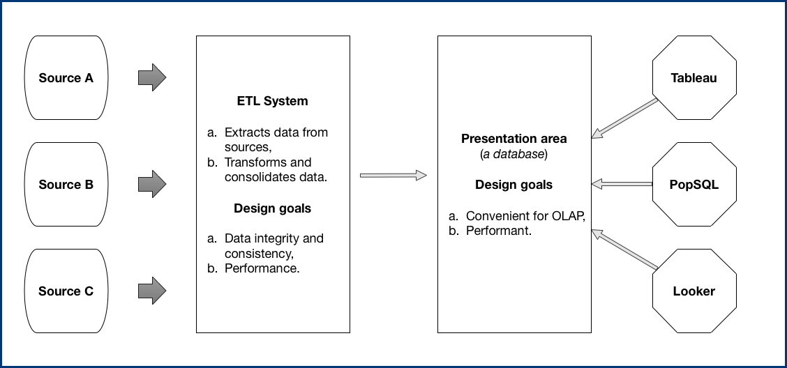
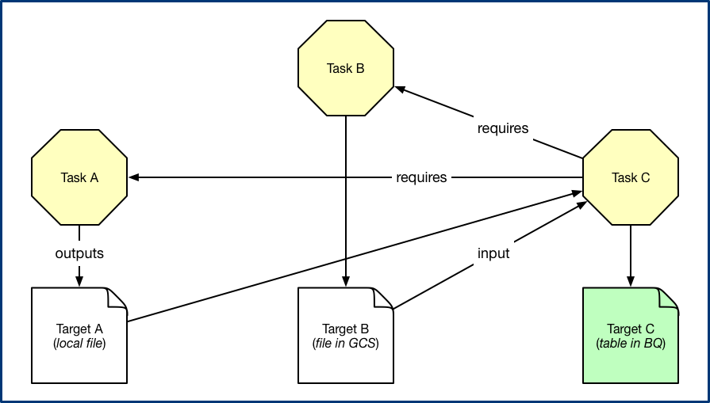
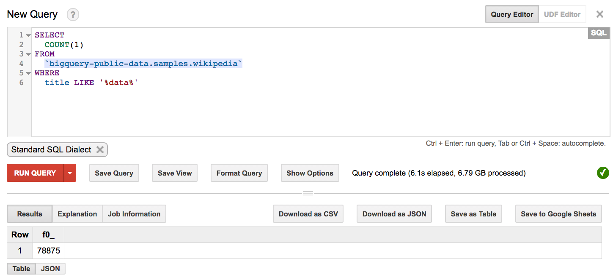

slidenumbers: true

[.footer: Artem Pyanykh (@artem_pyanykh), Moscow, 2018]

# [fit] **Data pipelines**
# <br/><br/><br/>
# [fit] From **zero**
# [fit] to
# [fit] **cloud** scale.


---

# About me

- My name is **Artem Pyanykh**.
- Ex Head of Analytics @ Toptal.
- Ex CTO @ Boomstarter.
- Onto a new venture to change retail landscape! <sup>We're hiring :wink:</sup>
- Proficient in data engineering, ML and making mistakes [^0].
- $$\lambda$$ = :heart:!


[^0]: ... which I hopefully learn from.

---

# [fit] Without
# [fit] further
# [fit] ado...

---

# What is the
# [fit] **essense**
# [fit] of data processing

---

# [fit] :hankey: :arrow_right: :crystal_ball: :arrow_right: :lollipop:

---

## :hankey: :arrow_right: :crystal_ball: :arrow_right: :lollipop:
# <br/>
# [fit] Just kidding
# <br/>
_Although, it's not too far from the truth!_

---

# **False dilemma** of data engineering


---

# [fit] Standing on the
# [fit] shoulders of giants

Data processing got much more accessible. Nowadays you can:

- start small,
- build a no BS solution,
- that delivers business value from day 1, and
- has great potential for scaling.


---

# Starting <sub>small</sub>

---

# Data processing pipeline



---

# Necessary components

| Component |     |
| ---       | --- |
| Computing | ?  |
| Storage | ? |
| Prog. Lang. | ? |
| Dependency Manager | ? |
| Frontend DB | ? |

---

# Minimal setup

| Component |     |
| ---       | --- |
| Computing | Linux Box |
| Storage | Local Disk |
| Prog. Lang. | Python |
| Dependency Manager | Luigi |
| Frontend DB | PostgreSQL     |

---

# [fit] A word on
# [fit] Luigi


---

Luigi has **tasks**, **targets** and **requirements**. When a **target** is **absent** a **task** is being **run**.



And that's it!

---

The **power** comes from these facts:

1. Tasks can be parameterized.
2. Targets can be pretty much anything.
3. Batteries included.

---

## A sample from our 
## production ETL


---

# [fit] Hands
# [fit] on
# [fit] time


---

# <sub>going</sub> BIG

---

# Missing pieces

We need these things in place to scale out:

1. durable and scalable storage,
2. distributed processing,
3. scalable OLAP Database.

---

# [fit] Let's see what
# [fit] **GCP**[^1]
# [fit] can offer

[^1]: Google Cloud Platform. Not affiliated, just happened to use at work.

---

# [fit] Storage


---

# Google Cloud Storage is

1. **Durable**. Over 9000 9's durability! Actually, it's 99.999999999%, but you get the point.
2. **Available**. 99.95% availability for Multi-Regional storage.
3. **Scalable**.
4. **Fully managed**.

---

# [fit] Processing


---

# [fit] Google Dataflow

1. Supports **distributed** computing via Apache Beam, which is a map-reduce like toolkit.
2. Fully **managed**.
3. Automatically horizontally **scalable**.
4. Integrates perfectly with other pieces of infrastructure inside GCP.

---

# [fit] Scalable
# [fit] OLAP
# [fit] Database


---
[.autoscale: true]

# We **want** an OLAP Database to be

1. Highly available.
2. Scalable around data ingestion and OLAP workload.
3. Flexible in regard to security and permissions.
4. Familiar to analysts.

---

# [fit] We **don't want** to
# [fit] spend time 
# [fit] managing OLAP Database.

---

# Is Google BigQuery the right choice?

1. Highly available :white_check_mark:
2. Scans TB of data in seconds :white_check_mark:
3. Permissions management is somewhat limited :neutral_face:
4. Good old SQL :white_check_mark:

---

And the **web-interface** is rather slick!



---

# Cloud setup

| Component |     |
| ---       | --- |
| Computing | Google Dataflow |
| Storage | Google Cloud Storage |
| Prog. Lang. | Python[^4] |
| Dependency Manager | Luigi |
| Frontend DB | Google BigQuery |

[^4]: You can also use Java + Beam SDK or Scala + Scio.

---

# [fit] Hands
# [fit] on
# [fit] time


---

# [fit] Costs


---

# Largest lines of expenditure

1. Cloud Storage is around $26 per TB/month.
2. Querying BigQuery is $5 per TB (first 1TB is free).
3. Computing costs ~$1.25/hr for 16CPU 100GB RAM or around $130/mo if cooked properly[^5].

[^5]: Assuming that ETL is continuously running for 3.5 hours a day on avg.

---

# What about AWS?

Similar setup in **Amazon** would include:

1. Amazon S3 which costs around $25 per TB of standard storage.
2. Amazon Athena which costs $5 per TB (_no first 1TB free_).

---

* In contrast to BigQuery **Athena works directly with files in S3**.
* So, if you scan a 1TB file while running a query, it'll cost you $5.
* But if you compress this file to 500GB, running the same query would cost you just $2.5.

---

**Athena pricing is more predictable** in this regard. 

But then you need to be mindful about **choosing appropriate storage format** like Parquet or **partitioning data** to restrict the amount of data scanned.

---

# [fit] Wrap up

1. Building a reasonable data processing solution is becoming easier these days.
2. You don't need to spend man-years to get something up & running.
3. Recurring infrastructure costs for start-ups and SMB can be less than a monthly supply of cookies for the team.

---

# [fit] Thanks for your
# [fit] attention!
# <br/>
# [fit] **Questions?**

```
-- speaker: Artem Pyanykh
-- twitter: @artem_pyanykh
-- email:   artem.pyanykh@gmail.com
```


