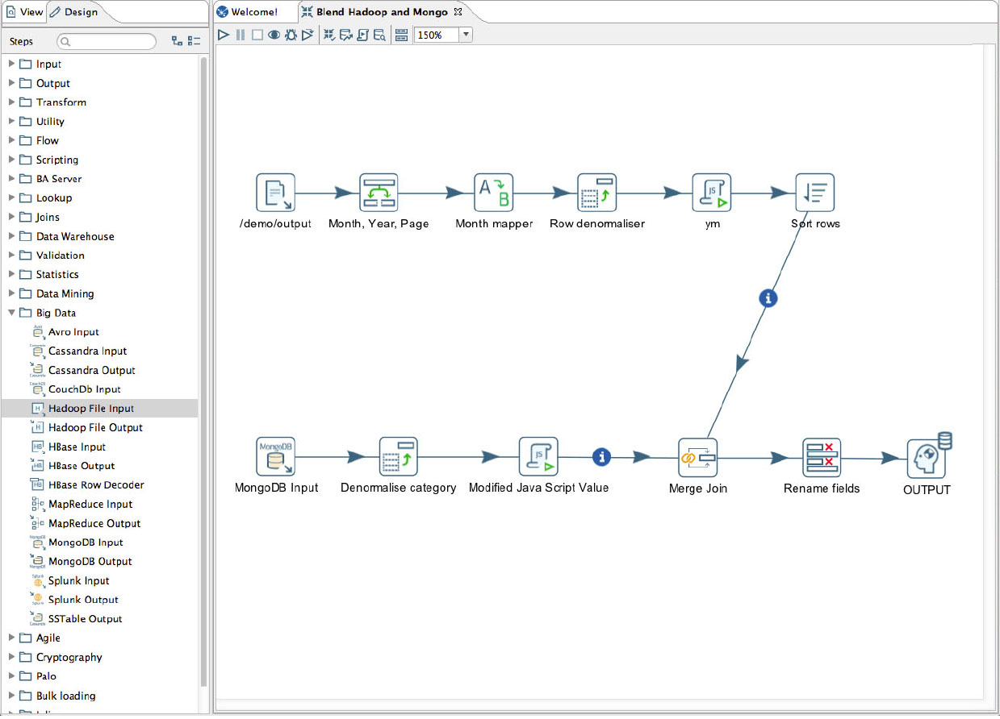

slidenumbers: true
footer: Artem Pyanykh (@artem_pyanykh), Alibaba, Moscow, 2018

# [fit] **Data pipelines**
# <br/><br/><br/>
# [fit] From **zero**
# to
# [fit] **cloud** scale.


---

# About me

* My name is **Artem Pyanykh**.
* I've worked as **engineer, data scientist, consultant and manager** in start-ups and SMB.
* Tools of choice are **Scala** and **Python**.
* At Toptal for more than 3 years, currently acting as **Head of Analytics**.


---

# About Toptal

* Toptal is a freelance platform like no other :wink:
* Main business differentiators are **strict quality control** on both talent and client sides, and **extreme operational efficiency**.
* This is possible because we have **top-notch talent** in the core team, and we make smart **decisions supported by data**.


---

# [fit] Let's
# [fit] get
# [fit] started

---

# What is DWH?

---
From Wikipedia:

> Data Warehouse is a store of data accumulated from a wide range of sources within a company and used to guide management decisions.

Main traits:

* Information is consolidates and consistent.
* Stores current and historical data in a single place.
* Used for decision making.

---

# Or simpler...

---

# [fit] DWH is 
# [fit] **DB** with data structured for **convenient OLAP**[^1]
# [fit] +
# [fit] necessary **infrastructure**.

[^1]: Star schema, dimensional modelling, etc.

---

# [fit] Why we've built
# [fit] **our own** DWH
# [fit] ?

---
[.build-lists: true]

* Extra **flexibility** and customization compared to proprietary solutions,
* Ability to use standard engineering **QA** tools and techniques (again, in contrast to proprietary solutions),
* It's actually pretty **easy**.



---

# What we 
# **will be**
# discussing

---

# [fit] How to build a scalable
# [fit] data warehousing solution

* within **reasonable** time
* with **reasonable** costs

# [fit] leveraging all the good stuff
# [fit] that big companies provide us.


---

# Classic DWH architecture


---

# Minimal single-machine setup

We need a \*nix machine with:

1. Enough storage, CPU and RAM :white_check_mark:
2. Python :white_check_mark:
3. PostgreSQL to act as a presentation area :white_check_mark:
4. Luigi _... to bring them all, and in the darkness bind them!_ ⚔️

---

# [fit] Wait!
# [fit] What's Luigi?


---

From a description on Github:

Luigi is a **Python module** that helps you build **complex pipelines** of batch jobs. It handles **dependency** resolution, **workflow** management, visualization etc. It also comes with Hadoop support built in.

---

[.autoscale: true]

# [fit] In other words,
# [fit] `make`
# [fit] **on steroids**.

---
Luigi has **tasks**, **targets** and **requirements**. When a **target** is **absent** a **task** is being **run**.


And that's it!

---

The **power** comes from these facts:

1. Tasks can be parameterized.
2. Targets can be pretty much anything.
3. Batteries included.

---

#This is how our production ETL pipeline looks like


---


---

# [fit] Hands
# [fit] on
# [fit] time


---

# Would I **run** this in **production**?

---

# [fit] No!


---

# For the peace of mind I'd rather have
1. More durable storage,
2. Proper serialization format,
3. Scalable OLAP Database.

---

# [fit] Storage


---

# [fit] In Cloud
# [fit] you don't choose storage.
# [fit] Storage chooses you.

---

# Google Cloud Storage is

1. Durable[^2],
2. Available[^3],
3. Scalable.


[^2]: Over 9000 9's durability! Actually, it's 99.999999999%, but you get the point.

[^3]: 99.95% availability for Multi-Regional storage.

---

# [fit] Looks
# [fit] **good**

---

# [fit] Serialization 
# [fit] Format


---

# [fit] **Truisms 101**


---

Apache **Avro** is a data **serialization system**.

It relies on **schemas** which are always present within the file, making serialized files **small** and **self-describing**.

---

An example **schema** in **Avro IDL** may look like

```scala
enum Gender {
  MALE, FEMALE
}

record Employee {
  string name;
  Gender gender;
  boolean active = true;
  long salary;
}
```

---

As a **serialization system** Apache **Avro** can be compared to **Thrift** and **ProtoBuf**.

## Avro has a couple **advantages**, such as:

1. Convenience when using with dynamic, scripting languages since schema is packed within the file.
2. Size of a serialized file is usually smaller.
3. It's supported out-of-the-box in Google Cloud.

---

As a **storage format** Apache **Avro** can be compared to **Parquet** and **ORC**.

# Essentially this choice is about

## **Row-based format**
## vs
## **Column-based format**.

---

# [fit] Scalable
# [fit] OLAP
# [fit] Database


---
[.autoscale: true]

# We **want** an OLAP Database to be

1. Highly available.
2. Scalable around data ingestion and OLAP workload.
3. Flexible in regard to security and permissions.
4. Familiar to analysts.

---

# [fit] We **don't want** to
# [fit] spend time 
# [fit] managing OLAP Database.

---

# Is Google BigQuery the right choice?

1. Highly available :white_check_mark:
2. Scans TB of data in seconds :white_check_mark:
3. Permissions management is somewhat limited :neutral_face:
4. Good old SQL :white_check_mark:

---

And the **web-interface** is rather slick!


---

# [fit] An updated list of DWH components would include:

1. A **\*nix machine** with Python and Luigi.
2. **GCS** as a distributed highly available storage.
3. **GBQ** as fully managed auto-scalable OLAP Database.

---

# [fit] Hands
# [fit] on
# [fit] time


---

# [fit] Costs


---

# Largest lines of expenditure

1. Cloud Storage is around $26 per TB/month.
2. Querying BigQuery is $5 per TB (first 1TB is free).
3. Compute engine costs $0.94/hr for 16CPU 104GB RAM machine or around $100/mo if cooked properly[^4].

[^4]: Assuming that machine is ETL'ing for 3.5 hours a day on avg. The price can be cut x4 using preemptible instances.

---

# [fit] There's a drawback:
# BigQuery pricing
# [fit] is **unpredictable**

---

* Loading data to BQ is free.
* But then BQ manages query plans on its own, and it's hard to tell how much data will be scanned in advance.

---

# What about AWS?

Similar setup in **Amazon** would include:

1. **Amazon S3** which costs around **$25 per TB** of standard storage.
2. **Amazon Athena** which costs $5 per TB (_no first 1TB free_).

---

* In contrast to BigQuery **Athena works directly with files in S3**.
* So, if you scan a 1TB file while running a query, it'll cost you $5.
* But if you compress this file to 500GB, running the same query would cost you just $2.5.

---

**Athena pricing is more predictable** in this regard. 

But then you need to be mindful about **choosing appropriate storage format** like Parquet or **partitioning data** to restrict the amount of data scanned.

---

# **Wrap up**

1. Building a reasonable data warehousing solution is becoming easier these days.
2. You don't need to spend man-years to get something up & running.
3. Recurring infrastructure costs for start-ups and SMB can be less than a monthly supply of cookies for the team.

---

# [fit] Thanks for your
# [fit] attention!


